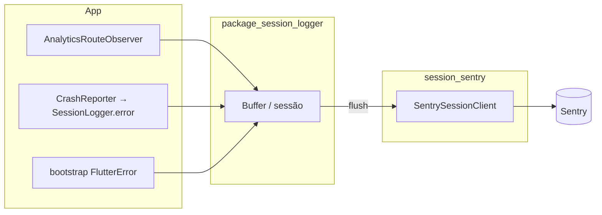

# Observabilidade — Session logger + Sentry

Documento de referência para **suporte**, **erros** e **trilho de sessão** no app do clínico. Detalhes de ficheiros e API: [lib/core/observability/README.md](../lib/core/observability/README.md). Pacote reutilizável: [modules/shared/session_sentry/README.md](../modules/shared/session_sentry/README.md).

---

## Objetivos

| Canal | Função |
|-------|--------|
| **Firebase Analytics** | Métricas de produto (eventos `cl_*`, ecrãs). Ver [ANALYTICS.md](ANALYTICS.md). |
| **Session logger** (`package_session_logger`) | Buffer de sessão: ecrãs, ações, infos, erros; envio conforme estratégia. |
| **Sentry** | Crashes, erros não tratados e eventos gerados no flush do session logger (`LogType.error` → `captureException`). |

Não há envio de trilho de sessão para Firestore; o destino configurado é o cliente Sentry do pacote `session_sentry`.

---

## Arranque (ordem relevante)

1. `SentryFlutter.init` (`lib/core/observability/launch_clinician_app.dart`) — DSN, `environment` = flavor, `sendDefaultPii: false`, `beforeSend` (filtro de compra cancelada).
2. `initPersistence` → `registerSessionLogger` → `registerCrashReporterIfNeeded` → `initAuth` → … → `configureDependencies` → `bootstrap`.

O **SessionLogger** tem de existir antes do auth e do sync para erros precoces e para o `SessionLoggerErrorReporter`.

Após `configureDependencies`, [`bootstrap`](../lib/bootstrap.dart) define handlers globais: `FlutterError`, `PlatformDispatcher` e **`BlocObserver.onError`** → `SessionLogger.error` quando o logger está registado.

---

## Fluxo de dados

- **Erros tratados** nos cubits/repositórios: `CrashReporter.recordError` → apenas `SessionLogger.error` (sem `captureException` direto no app).
- **Flush**: `SentrySessionClient` envia `LogType.error` como evento (com **fingerprint** estável) e o resto como **breadcrumbs**.

---

## Configuração

| Item | Onde |
|------|------|
| DSN | `--dart-define=SENTRY_DSN=...`; ver `lib/core/observability/sentry_dsn.dart` |
| Símbolos / upload CI | [DEPLOY.md](DEPLOY.md) (`SENTRY_ORG`, `SENTRY_PROJECT`, `SENTRY_AUTH_TOKEN`) |
| Filtro RevenueCat | `sentryBeforeSend` em `package:session_sentry` |

---

## Privacidade

- Sem PII por defeito no Sentry (`sendDefaultPii: false`).
- Utilizador: UID opaco no scope; não enviar nomes de pacientes ou dados clínicos em `data` dos logs.

---

## ID de Suporte (utilizador logado)

O valor que o clínico vê em **Configurações → Suporte → ID de Suporte** é o **Firebase UID** (`AuthUser.uid`), o mesmo que:

1. **`init_session_logger_user_binding`** (`lib/core/observability/init_session_logger_user_binding.dart`) envia a `SessionLogger.setUser` em cada mudança de `AuthRepository.authStateChanges`.
2. **`SentrySessionClient.setUserId`** (`package:session_sentry`) aplica no Sentry: `SentryUser(id: …)` e tags **`user`** e **`support_id`** com esse UID — útil para filtrar issues por identificador que o utilizador enviou ao suporte.

Sem login, o cartão do ID não é mostrado; no logout, o utilizador e as tags são limpos no scope.

Documentação da feature (UI, i18n): [modules/features/settings/docs/support-id.md](../modules/features/settings/docs/support-id.md).

---

## Referências

| Documento | Conteúdo |
|-----------|-----------|
| [lib/core/observability/README.md](../lib/core/observability/README.md) | Tabela analytics vs session, áreas instrumentadas, `CrashReporter` |
| [modules/shared/session_sentry/README.md](../modules/shared/session_sentry/README.md) | Pacote `SentrySessionClient` + `sentryBeforeSend` |
| [ANALYTICS.md](ANALYTICS.md) | Firebase / rotas (inclui `sessionLogger` no observer) |
| [DEPLOY.md](DEPLOY.md) | Variáveis Sentry no deploy |
| [modules/features/settings/docs/support-id.md](../modules/features/settings/docs/support-id.md) | ID de Suporte na UI e correlação com Sentry |
